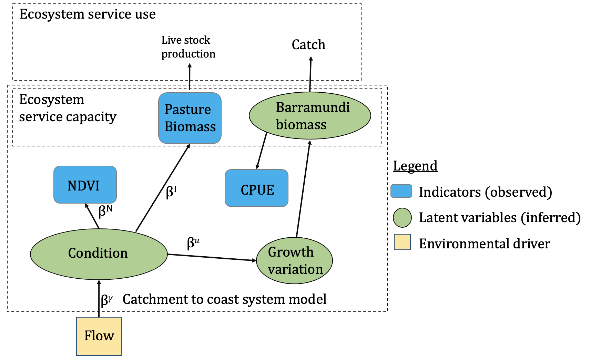

# Code to support "Detecting change in interconnected ecosystem assets to inform indicators of condition in environmental economic accounts"

Christopher J. Brown et al.
Contact: chris.brown@griffith.edu.au

[A preprint is available on bioRxiv](https://www.biorxiv.org/content/10.1101/2021.07.19.453015v1)
.

Data used in model fitting are also provided as a csv for convenience, but please see Table S1 of the preprint for data sources. It is recommended you consult those sources, and their caveats, before using the data for other projects.

**Model structure overview**

**Model data fits and prediction of ecological condition**

## Files

Files for all the model runs (.rda files) and figures not provided here, due to size.
Example model run files are in: fitted-model-examples/. You will have to update paths in the scripts to use these example files.

### fit-indicator-model.R

Fit the model to data. Also contains options to refit for different catchability and initial biomass settings

### indicator-model.stan  

Stan code for the model

### plot-model-fits.R  

Create plots and tables from paper for the results in fit-indicator-model.R
(figure 2)

### plot-model-sens.R

As above, but plot for each of the different catchability and initial biomass parameters

### effect-sizes.R

Create plot for effect size (figure 3)

### emergence-time.R

Generate results and plots for emergence time (figures 4 & 5)

### emergence-time-sensitivity-analysis.R
As above, but creates plots for models fit with each of the different catchability and initial biomass parameters

### model-functions.R

Functions needed for calculating emergence time and running the sim study

### loop-fit-simulations.R

Fit the indicator model to simulated data

### plot-loop-fit-simulations.R

Plots results of simulation study in loop-fit-simulations.R

### compare-composite-indicators.R

Compare the model based indicator to a traditional indicator based on the weighted sum of indicator values. Not used in the publication.
